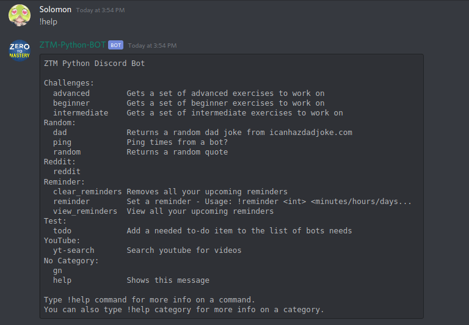

# ZTM-Python-Discord-Bot-Almuni

A Discord bot written in Python by and for the [Zero To Mastery](https://zerotomastery.io/) community during the [Frosty February hackathon](https://github.com/zero-to-mastery/frosty-february-hackathon).

## Goal

The main goal behind this project is to help members find projects. Each project will be categorized under Beginner, Intermediate or Advanced.

## Getting Started

This project was created using the latest version of discord.py. You can find the documentation [here.](https://discordpy.readthedocs.io/en/latest/)

### Prerequisites
* python v3.7
* discord v1.0.1
* discord.py v1.3.1
* praw v6.5.1
* tinydb v3.15.2
* requests v2.22.0
* beautifulsoup4 v4.8.2

## Features

All the features/commands of the bot alongsidetheir descriptions can be viewed in the screenshot below:

## Contribute

Before you start contributing, please read our [code of conduct](https://github.com/thereaper90917/ZTM-Python-Discord-Bot-Almuni/blob/master/CODE_OF_CONDUCT.md) first. Then, the following steps should be followed:

* Fork this repository
* Clone the forked repository to your local machine
* On the cloned repository, create a new branch
* Work on a new feature, fix bugs in the code or do some code refactoring
* Push your commits and submit a PR!

This [article](https://akrabat.com/the-beginners-guide-to-contributing-to-a-github-project/) covers the above process in more detail.

## Contributors

